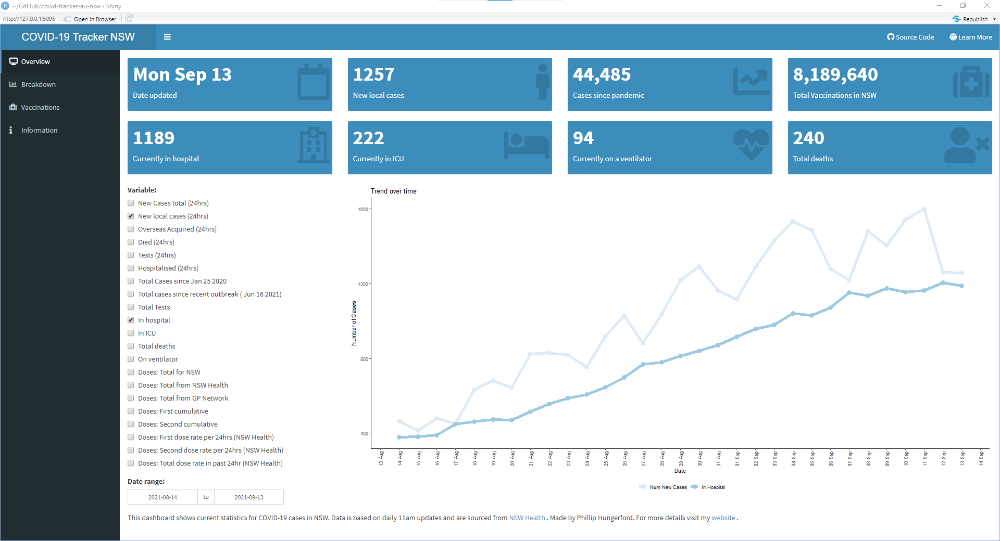
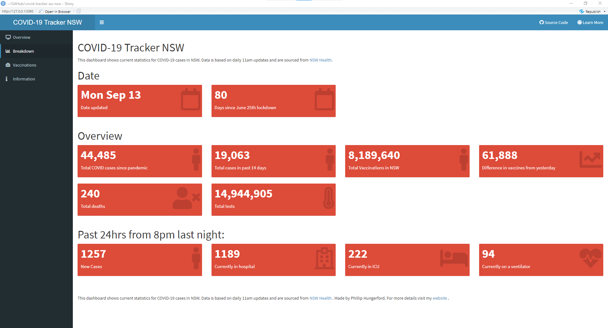
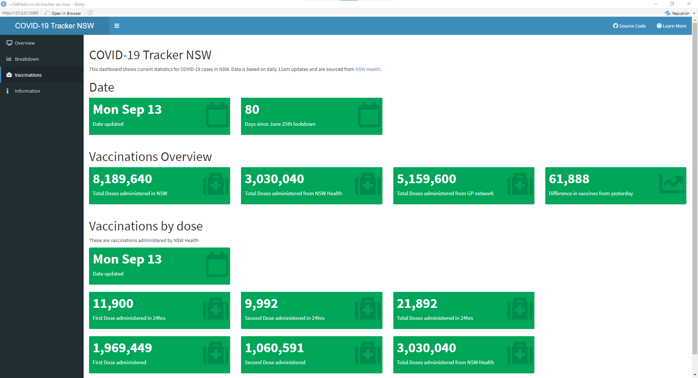
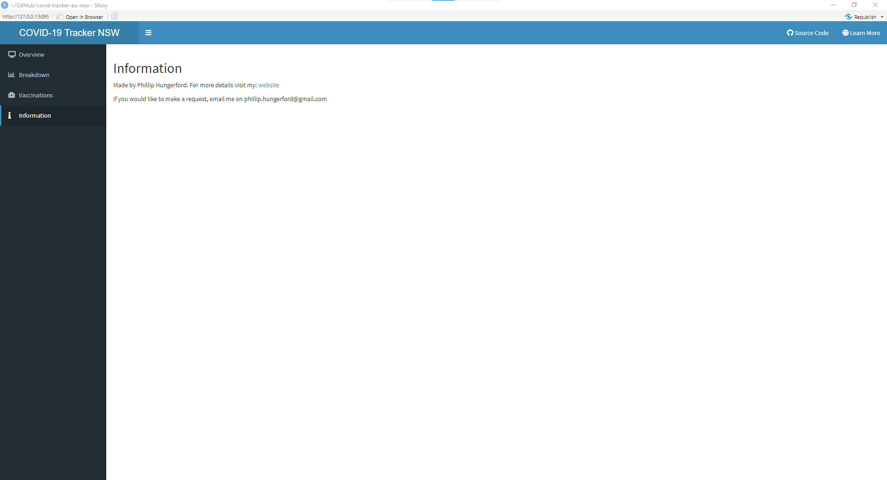

# COVID-19 Tracker NSW
This is a very simple dashboard that shows the NSW Health [data](https://www.health.nsw.gov.au/Infectious/covid-19/Pages/stats-nsw.aspx) regarding COVID cases in NSW. Dashboard is hosted on the shiny apps server [here](https://philliphungerford.shinyapps.io/covid-tracker-au-nsw/).

